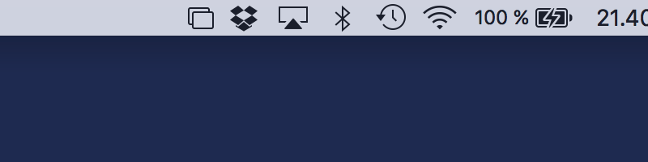

Phoenix
=======

A lightweight OS X window and app manager scriptable with JavaScript. You can also easily use languages which compile to JavaScript such as CoffeeScript. Phoenix aims for efficiency and a very small footprint. If you like the idea of scripting your own window or app management toolkit with JavaScript, Phoenix is probably going to give you the things you want. With Phoenix you can bind keyboard shortcuts and system events, and use these to interact with OS X.

- Current version: 2.0 ([Changelog](CHANGELOG.md))
- Requires: OS X 10.10 or higher (Xcode 7 required for building)

**Note:** the default `master`-branch will always be stable.

## Install

To install Phoenix, you will first need to build it. Install Xcode from the App Store, if you do not already have it installed. You will also need Xcode command line tools — you will be prompted for this. Then, from a terminal run the following:

    git clone https://github.com/kasper/phoenix.git
    cd phoenix
    git checkout 2.0
    xcodebuild clean build

Once complete, you will find a newly built Phoenix app in `build/Release/`. To install, just drag-and-drop it to your `Applications`-folder. When you run Phoenix for the first time, you will be asked to allow it to control your UI. OS X will ask you to open `Security & Privacy` in System Preferences. Once open, go to the `Accessibility`-section and click the checkbox next to Phoenix to enable control. An admin account is required to accomplish this.

## Usage

Phoenix lives on your status bar and can be scripted in JavaScript (or languages which compile to JavaScript such as CoffeeScript). See the [JavaScript API](API.md) to get started with your script. Your script should reside in `~/.phoenix.js` — the file will be created when you launch Phoenix for the first time. For ideas, see what other people have built in their configurations in the [Wiki](https://github.com/kasper/phoenix/wiki/). Feel free to add your own configuration to the Wiki to show other people the nice things you can do. Previous configurations (<= 1.5) are not compatible with 2.0, see Changelog for what changes are needed.

- [JavaScript API](API.md)
- [Examples](https://github.com/kasper/phoenix/wiki#examples)
- [Changelog](CHANGELOG.md)

## Contributing

Feel free to contribute to this project by creating issues, pull requests and editing the Wiki. See the [guidelines](CONTRIBUTING.md).

## Thanks

Phoenix is currently developed by Kasper Hirvikoski ([@kasper](https://github.com/kasper/)) and Jason Milkins ([@jasonm23](https://github.com/jasonm23/)) with the generous help of contributions made by many [individuals](https://github.com/kasper/phoenix/graphs/contributors/). It was originally authored by Steven Degutis ([@sdegutis](https://github.com/sdegutis/)) as a fork of Zephyros — also an app of his. As it stands now, it has been rewritten from the ground up by Kasper Hirvikoski. Steven is continuing his work on OS X window management in [Mjolnir](https://github.com/sdegutis/mjolnir/).

## License

Released under the MIT License. See [license](LICENSE.md).
