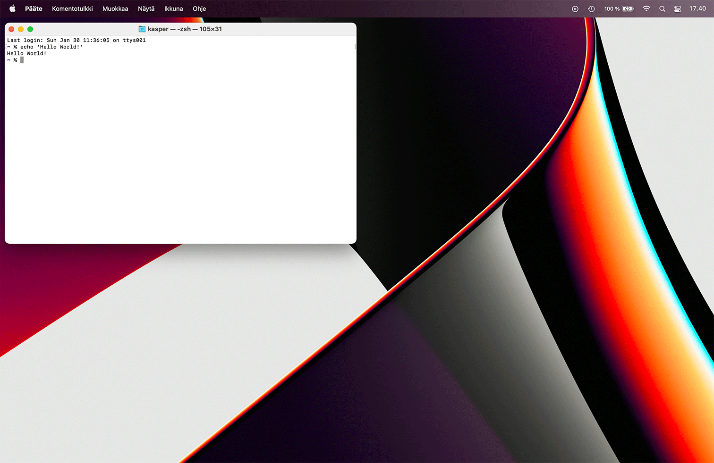

Phoenix
=======

A lightweight macOS window and app manager scriptable with JavaScript. You can also easily use languages which compile to JavaScript such as CoffeeScript. Phoenix aims for efficiency and a very small footprint. If you like the idea of scripting your own window or app management toolkit with JavaScript, Phoenix is probably going to give you the things you want. With Phoenix you can bind keyboard shortcuts and system events, and use these to interact with macOS.

- Current version: 2.6.7 ([Changelog](CHANGELOG.md))
- Requires: macOS 10.10 or higher

**Note:** the default `master`-branch will always be stable.

## Key Features

- highly customisable, write your own configuration
- bind keyboard shortcuts and system events to your callback functions
- control and interact with your screens, spaces, mouse, apps and windows
- log messages, deliver notifications or display content as modals
- run external commands

## Install

- [**Download Phoenix**](https://github.com/kasper/phoenix/releases/download/2.6.7/phoenix-2.6.7.tar.gz)
- See previous [releases](https://github.com/kasper/phoenix/releases/)

To install, extract the downloaded archive and just drag-and-drop Phoenix to your `Applications`-folder. When you run Phoenix for the first time, you will be asked to allow it to control your UI. macOS will ask you to open `Security & Privacy` in System Preferences. Once open, go to the `Accessibility`-section and click the checkbox next to Phoenix to enable control. An admin account is required to accomplish this.

Alternatively, if you have [Homebrew](https://brew.sh) installed, you can simply run `brew install --cask phoenix`.

## Uninstall

To uninstall Phoenix, delete the app from your `Applications`-folder. The configuration file created by Phoenix itself is located in your home folder. Delete `~/.phoenix.js` and any related configurations if desired. For developers, you may also need to delete `~/.phoenix.debug.js`.

If you have used the storage, also delete the file `~/Library/Application Support/Phoenix/storage.json`. Again for developers, you may also need to delete `~/Library/Application Support/Phoenix/storage.debug.json`.

## Usage

Phoenix lives on your status bar (or as a background daemon) and can be scripted in JavaScript (or languages which compile to JavaScript such as CoffeeScript).

See the [JavaScript API](docs/API.md) to get started with your script. Your script should reside in `~/.phoenix.js` — the file will be created when you launch Phoenix for the first time. Alternatively — if you prefer — you may also have your script in `~/Library/Application Support/Phoenix/phoenix.js` or `~/.config/phoenix/phoenix.js`. For ideas, see what other people have built in their configurations in the [Wiki](https://github.com/kasper/phoenix/wiki/). Feel free to add your own configuration to the Wiki to show other people the nice things you can do. Previous configurations (<= 1.5) are not compatible with 2.0, see Changelog for what changes are needed.

- [JavaScript API](docs/API.md) (master)
- [JavaScript API](https://github.com/kasper/phoenix/blob/2.6.7/docs/API.md) (current)
- [Examples](https://github.com/kasper/phoenix/wiki#examples)
- [Changelog](CHANGELOG.md)

## Development

You will need some basic knowledge about installing the required languages and tools. If you need help, do not hesitate to ask! To get started, you will need:

1. Git
2. Xcode 12 or higher
3. Xcode command line tools

First clone the repository from a terminal:

    git clone https://github.com/kasper/phoenix.git
    cd phoenix

To develop Phoenix, open `Phoenix.xcworkspace` in Xcode. Install Xcode from the App Store, if you do not already have it installed. You will also need Xcode command line tools — you will be prompted for this. Everything else should work as is — you can develop, debug, test, build and run Phoenix straight from Xcode.

To install Phoenix from the source, you will need to build the workspace from a terminal:

    xcodebuild -workspace Phoenix.xcworkspace \
               -scheme Phoenix \
               -configuration Release \
               SYMROOT="$PWD/build/" \
               clean build

Once complete, you will find a newly built Phoenix app in `build/Release/`. After this, you can follow the normal install guide.

Phoenix manages dependencies with [CocoaPods](https://cocoapods.org). Note that you do not need CocoaPods for basic development. However, if you want to install new pods or update existing ones, you will also need:

4. [Ruby](https://www.ruby-lang.org) (2.7.3 or higher), it is recommended that you manage Ruby versions with for instance [rbenv](https://github.com/rbenv/rbenv/)
5. [Bundler](http://bundler.io)
6. CocoaPods

Install Bundler, if you do not already have it installed. To install CocoaPods and its dependencies, use Bundler inside the `phoenix`-directory to install the required Ruby gems according to the `Gemfile`. Once complete, you can install the pods listed in the `Podfile` with CocoaPods.

    gem install bundler
    bundle install
    pod install

In addition to the Objective-C core, Phoenix also uses a JavaScript-based (5.1) library to implement additional features to the API. The minified library is included in the repository in `Phoenix/phoenix-min.js` so that everything works as is. However, if you want to develop features for this library, you will also need:

7. [Node.js](https://nodejs.org) (16.2.0 or higher)

Install the development packages listed in `package.json`.

    npm install

To build `phoenix-min.js` from the source, run the command `npm run build` in the root directory. NPM will then build the source from `library/src/` and install the new library to `Phoenix/phoenix-min.js`. For convenience, this is also handled automatically by Xcode when you build Phoenix.

## Contributing

Feel free to contribute to this project by creating issues, pull requests and editing the Wiki. See the [guidelines](.github/CONTRIBUTING.md).

## Contact

If you have any questions, feedback or just want to say hi, you can open an issue, [email](mailto:kasper@kytkemo.com) or [tweet](https://twitter.com/kasper/).

## Thanks

Phoenix is currently being developed by Kasper Hirvikoski ([@kasper](https://github.com/kasper/)) with the generous help of contributions made by many [individuals](https://github.com/kasper/phoenix/graphs/contributors/). It was originally authored by Steven Degutis ([@sdegutis](https://github.com/sdegutis/)). As it stands now, it has been rewritten from the ground up by Kasper Hirvikoski.

## License

Released under the MIT License. See [license](LICENSE.md).
